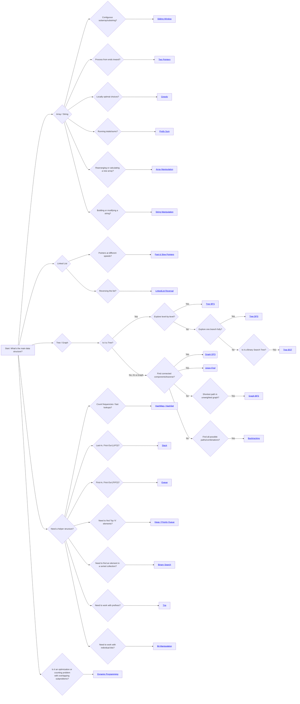

# LeetCode Patterns Flowchart

This flowchart is a decision tree to help identify the correct data structure or algorithm pattern for a given LeetCode problem. Click on a pattern name to see a detailed explanation and a sample problem.

## Above Patterns in alphabetical order

* [Array Manipulation](array_manipulation.md)
* [Backtracking](backtracking.md)
* [Binary Search](binary_search.md)
* [Bit Manipulation](bit_manipulation.md)
* [Dynamic Programming](dynamic_programming.md)
* [Fast & Slow Pointers](fast_and_slow_pointer.md)
* [Graph BFS](tree_bfs.md)
* [Graph DFS](graph_dfs.md)
* [Greedy](greedy.md)
* [HashMap / HashSet](hash_map_set.md)
* [Heap / Priority Queue](heap.md)
* [Linked List Reversal](linked_list.md)
* [Prefix Sum](prefix_sum.md)
* [Queue](queue.md)
* [Sliding Window](sliding_window.md)
* [Stack](stack.md)
* [String Manipulation](string_manipulation.md)
* [Tree & Graph Traversals (General)](tree_and_graph_traversals.md)
* [Tree BFS](tree_bfs.md)
* [Tree BST](tree_bst.md)
* [Tree DFS](tree_dfs.md)
* [Trie](trie.md)
* [Two Pointers](two_pointers.md)
* [Union-Find](union_find.md)

## Other Patterns

Here are some additional patterns documented in this directory that are not explicitly represented in the flowchart above.

*   [Tree & Graph Traversals (General)](tree_and_graph_traversals.md)